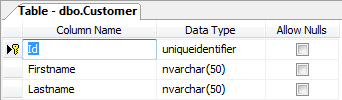
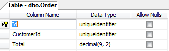
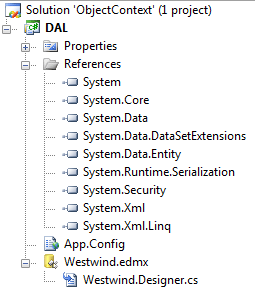
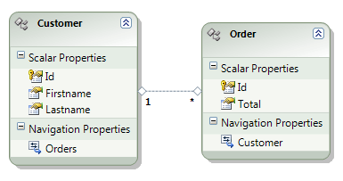
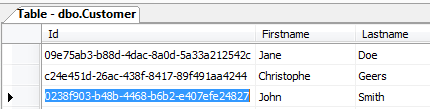
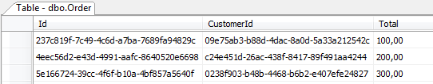
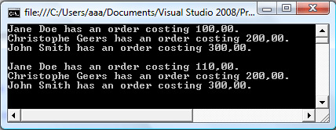
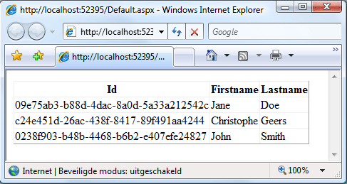

# Entity Framework ObjectContext

## Introduction

It's been a good two months since the last post. Today I finally found some spare time to write a new article about .NET. This will be the first article on this blog focusing solely on the Entity Framework. More in particular about using the Entity Framework in different environments such as Windows Applications and in an ASP.NET environment.

The Entity Framework has some drawbacks that will hopefully be addressed in the second release, but in its current state it's already a really useful technology to use for database access.

This article will not discuss every feature of the Entity Framework as that would entail writing an entire book. The primary focus is on how to deal with the ObjectContext in different environments such as a regular Windows Application and a Web Application (ASP.NET). Let's get started...

## ObjectContext

As you may be aware every object returned by a query (Linq To Entities, Entities SQL...) is automatically attached to an object context. This context tracks the changes applied to these objects so that it can later figure out how to persist these changes to the underlying data store.

This object context is represented by a class fittingly named ObjectContext. The ObjectContext encapsulates a couple of things, namely:

- The connection to the underlying data store (database)
- Metadata describing the Entity Data Model (EDM)
- An ObjectStateManager for tracking changes to the objects

As you will see in the next sections how you deal with the ObjectContext depends on the target platform of your application.

## Demo Solution

Let's quickly setup up a demo project that we can use throughout the rest of this text. First let us create a simple database using SQL Server consisting out of two tables \[Customer\] and \[Order\].

The following two figures list the columns for each of these tables. You can find the DDL statements to build this database in the source code accompagnying this article.

I've called my database "Westwind" but feel free to choose a more appropriate name.

**Figure 1** - Customer table



**Figure 2** - Order table



The \[Order\] table contains a foreign key connecting it's CustomerId column to the Id column of the \[Customer\] table. Thanks to this relation we can easily navigate back and forth between the Customer and Order entities in the resulting Entity Data Model (EDM).

Now fire up Visual Studio 2008 and create a new blank solution named "ObjectContext" and add a class library to it (C#) titled "DAL" (short for Data Access Layer). Delete the automatically generated class Class1 and add a new ADO.NET Entity Data Model called "Westwind.edmx".

Using the resulting wizard choose the option "Generate from database" to let Visual Studio generate an Entity Data Model based upon the previously created database. After the model is generated the necessary references to the required assemblies are automatically added to the project.

**Figure 3** - ObjectContext Solution



The Entity Data Model contains two entities, namely Customer and Order. I've renamed the Entity Set Name properties of the Customer and Order entities respectively to Customers and Orders. As a last step the navigation property Order on the Customer entity has been renamed to Orders as a customer can have one or more orders.

**Figure 4** - Westwind Entities



Voila, that concludes setting up the demo project. Let's move on to the next section...

**Remarks**

- Be sure you have the first service pack installed for both the .NET Framework 3.5 and Visual Studio 2008 as both are required in order to be able to work with the Entity Framework.
- The example is kept as simple as possible in order to focus solely on the subject of this article. It's not a guideline on how to organize your projects into different layers and such.

## Windows Application

I've added some dummy data to the table using SQL Server Management Studio Express. There are three customer and each has exactly one order.

**Figure 5** - Customer Data



**Figure 6** - Order Data



Regular Windows Applications (Console, WinForms, WPF...) are the easiest to work with in regard to handling the ObjectContext. Let's demonstrate this using a Console application.

Add a new Console application and add a reference to the DAL project and the System.Data.Entity assembly. Next add an application configuration file (App.config) and copy the connection string found in the App.config file of the DAL project. Finally add the code of Listing 1 to the main method.

**Listing 1** - ObjectContext in a Console application

```csharp
using (var context = new WestwindEntities())
{
    // Query all the orders.
    var q = from o in context.Orders.Include("Customer") orderby o.Total select o;
    foreach(var order in q)
    {
        Console.WriteLine(String.Format("{0} {1} has an order costing {2}.",
                                        order.Customer.Firstname, order.Customer.Lastname,
                                        order.Total));
    }
    Console.WriteLine();

    // Update the first order.
    Order firstOrder = q.FirstOrDefault();
    if (firstOrder != null)
    {
        firstOrder.Total += 10;
        context.SaveChanges();
    }

    // Display the order once more.
    foreach (var order in q)
    {
        Console.WriteLine(String.Format("{0} {1} has an order costing {2}.",
                                        order.Customer.Firstname, order.Customer.Lastname,
                                        order.Total));
    }

    Console.ReadLine();
}
```

A new connection (context) is made to the database and the orders are queried and displayed. Next the first order found is updated and finally the orders are displayed once more.

All this happens using the same ObjectContext (see the using statement). It tracks the changes made to the order objects and generates the necessary SQL to persist these changes in the database upon the call to context.SaveChanges().

**Figure 7** - The Output



If you're interested in finding out what the generated SQL looks like I recommend using the [AnfiniL's SQL Express Profiler](http://sqlprofiler.googlepages.com/) tool. It's free and easy to use.

## Shared ObjectContext

You can as the previous example has shown create an ObjectContext when needed and dispose of it immediately after. However you can also choose to share the same ObjectContext accross multiple methods, instances...etc. if you want to limit the amount of ObjectContext instances in your application.

One way of doing this is to encapsulate the ObjectContext in a class that adheres to the singleton pattern. Take a look at the code in Listing 2.

**Listing 2** - Shared ObjectContext

```csharp
public class SharedObjectContext
{
    private readonly WestwindEntities context;

    #region Singleton Pattern

    // Static members are lazily initialized.
    // .NET guarantees thread safety for static initialization.
    private static readonly SharedObjectContext instance = new SharedObjectContext();

    // Make the constructor private to hide it.
    // This class adheres to the singleton pattern.
    private SharedObjectContext()
    {
        // Create the ObjectContext.
        context = new WestwindEntities();
    }

    // Return the single instance of the ClientSessionManager type.
    public static SharedObjectContext Instance
    {
        get
        {
            return instance;
        }
    }

    #endregion

    public WestwindEntities Context
    {
        get
        {
            return context;
        }
    }
}
```

The following Listing shows how you would use this shared ObjectContext.

**Listing 3** - Usage Of The Shared ObjectContext

```csharp
WestwindEntities context = SharedObjectContext.Instance.Context;

var q = from o in context.Orders.Include("Customer") orderby o.Total select o;

foreach (var order in q)
{
    Console.WriteLine(String.Format("{0} {1} has an order costing {2}.",
                                    order.Customer.Firstname, order.Customer.Lastname,
                                    order.Total));
}

Console.ReadLine();
```

You can find this code in the ConsoleSharedObjectContext project included in the demo source code.

**Remark**: Limit the scope of the ObjectContext. It is recommended to use the ObjectContext instance within a using statement. This ensures that the resources associated with the ObjectContext are automatically disposed when the using statement exists. Make sure your application benefits from a shared ObjectContext, for instance if you bind control to objects maintained by the ObjectContext.

## ObjectContext in ASP.NET

To quote [MSDN](http://www.msdn.com): "The ObjectContext class is not thread safe. The integrity of data objects in an ObjectContext cannot be ensured in multi-threaded scenarios.".

This rules out using the afore mentioned approach in an ASP.NET environment as it is inheritly multi-threaded. Each request is handled by a separate thread. To circumvent the problem the solution is to use an ObjectContext per Http request. The following Listing shows one possible approach.

**Listing 4** - ObjectContext Per Http Request

```csharp
public static class ObjectContextPerHttpRequest
{
    public static WestwindEntities Context
    {
        get
        {
            string objectContextKey = HttpContext.Current.GetHashCode().ToString("x");
            if (!HttpContext.Current.Items.Contains(objectContextKey))
            {
                HttpContext.Current.Items.Add(objectContextKey, new WestwindEntities());
            }
            return HttpContext.Current.Items[objectContextKey] as WestwindEntities;
        }
    }
}
```

To demonstrate its usage add a new Web Application project to the solution, add the necessary references to the DAL project and the System.Data.Entity assembly. Finally add the connection string to the Web.config file.

Open up the default.aspx page in design view and add a GridView. Add the following code to the code-behind in the Page_Load(...) event handler to bind some data to the grid.

**Listing 5** - Default.aspx.cs code-behind

```csharp
protected void Page_Load(object sender, EventArgs e)
{
    WestwindEntities context = ObjectContextPerHttpRequest.Context;
    GridView1.DataSource = from c in context.Customers select c;
    GridView1.DataBind();
}
```

The output is a list of the customers.

**Figure 8** - The Output In ASP.NET



## Summary

While there is much debate going on about the Entity Framework I certainly feel that this first release offers a valid alternative to any prior existing data access technologies.

Working with the Entity Framework entails dealing with the ObjectContext. As demonstrated the way the ObjectContext is too be handled depends on the target platform. Sharing the ObjectContext on one thread poses no problem (Windows Applications), however as soon as you end up in a multi-threaded environment (ASP.NET) you must implement some custom logic to ensure the integrity of the data objects within the ObjectContext.
